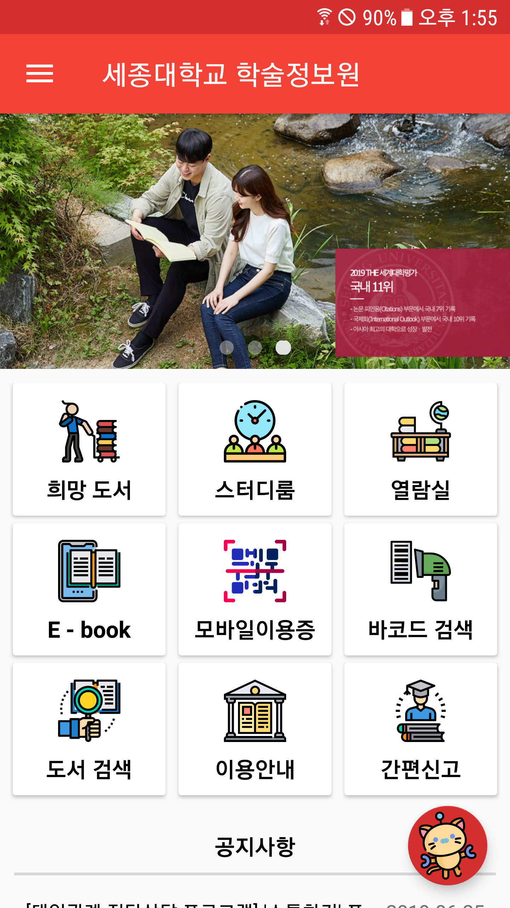
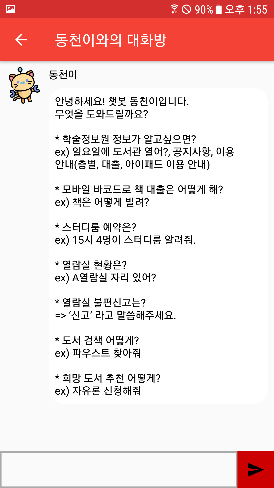
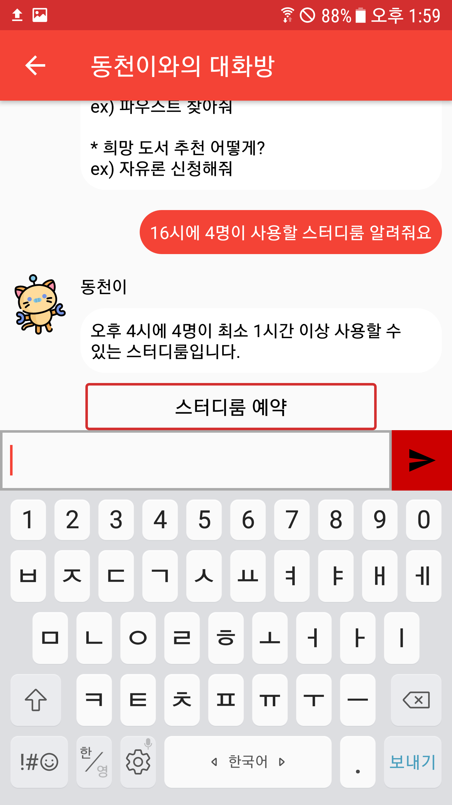
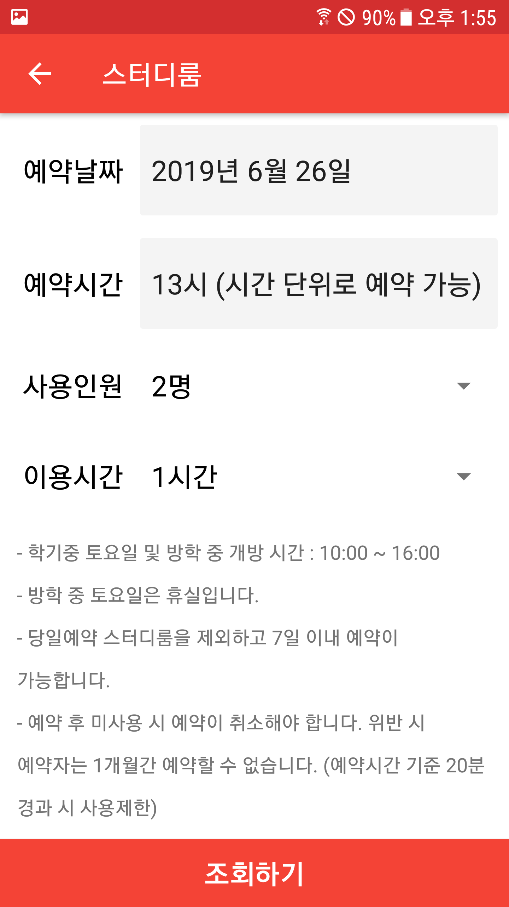
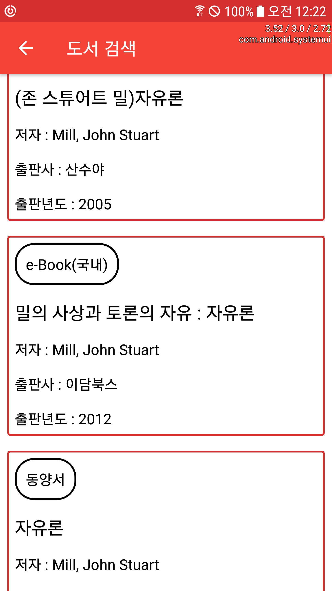
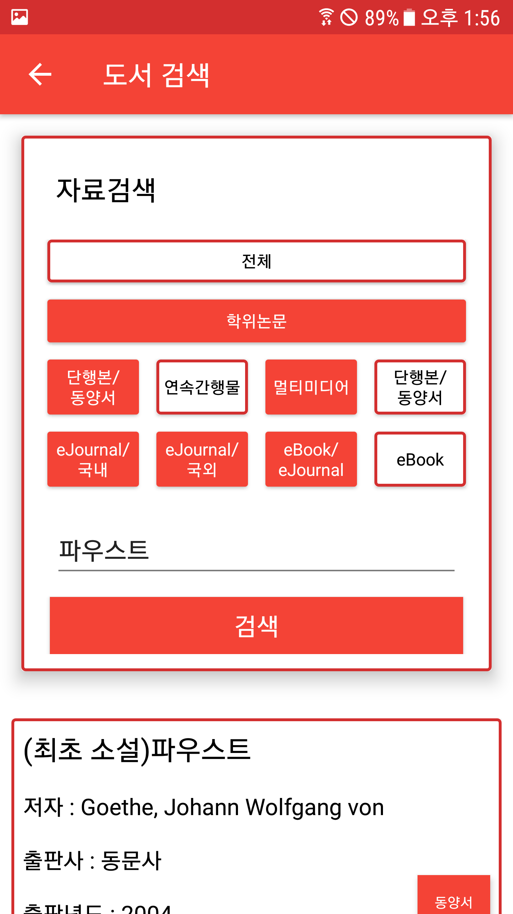

# 세종대학교 학술정보원 모바일
- 2019-2 "캡스톤 디자인"
- 개발기간 : 19년 3월 9일 ~ 19년 6월 20일
- Android App
- **조성동(팀장, 도서 검색, 챗봇, 스터디룸, FCM)**, 최환(희망도서, 이용안내, 네비게이션), 김형호(바코드 검색, 공지사항, 간편신고), 유승훈(소개자료 및 리소스)
- [프로젝트 기획서](https://drive.google.com/open?id=1mLHD0L7lBuG7lRiZdrffn4N-67RMwigA)
- 챗봇 기반의 세종대학교 학술정보원(도서관) Android 어플리케이션으로써 챗봇 이외에도 바코드 검색을 통한 대출, 도서 검색, 열람실 불편신고, 스터디룸 예약 등 다양한 도서관 서비스를 제공합니다.  
- **Stack :** Java, Android, Node.js

## 목차
- [Screenshots](#Screenshots)
- [소개영상](#소개영상)
- [보도자료](#보도자료)

---

## Screenshots

 

  

## [소개영상]([Youtube](https://www.youtube.com/watch?v=wg9XUbCz-Y8))

## 보도자료

- [동아일보 [세종대, SW·인공지능 해커톤 진행\]](http://www.donga.com/news/article/all/20190716/96492579/1)
- [세종대학교 홍보실 [세종대 SW중심대학 사업단, ‘제6회 SW·인공지능 해커톤’ 성료\]](http://www.sejongpr.ac.kr/sejongnewspaperview.do?boardType=4&pkid=15815)
- **SNS**
  - [Facebook](https://www.facebook.com/252430878289621/posts/1035712883294746/)
  - [Instagram](https://www.instagram.com/p/Bz785U3pwC5/?igshid=1lhnsvcht0ibc)

